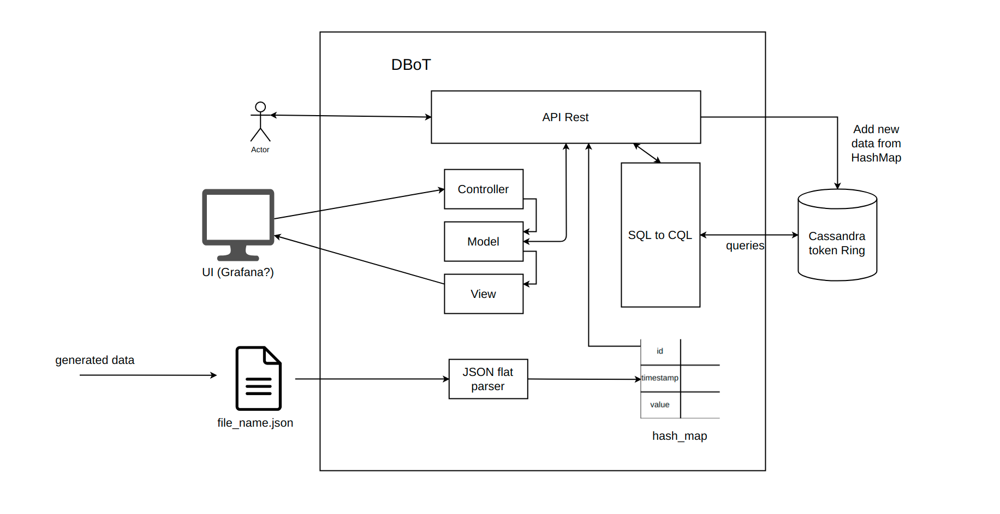

# DBoT - Database of Things

A software product which can collect and analyse IoT data.

## Setup and execution of code

1. Install the requirements.

```bash
pip install -r requirements.txt
```

## Arquitecture



## Data Model

```json
Json1 = {"sensorId" : "0001",
"timeStamp" : "2020-06-01 10:10:10",
"temperature" : "10"}

Json2 = {"sensorId" : "0002",
"timeStamp" : "2020-06-01 10:10:10",
"temperature" : "11"}

Json3 = {"sensorId" : "0001",
"temperature" : "10"}
```

* Metadata(atribute, pk) PRIMARY KEY(atribute, pk)

[]()|[]()
---     |    ---
'temperature' | 'pk1uuid'
'sensorid' | 'pk1uuid'
'timestamp' | 'pk1uuid'
'temperature' | 'pk2uuid'
'sensorid' | 'pk2uuid'
'timestamp' | 'pk2uuid'
'temperature' | 'pk3uuid'
'sensorid' | 'pk3uuid'
[]()|[]()


* Sensors(user, sensorId, pkList) PRIMARY KEY(user, sensorId)

[]()|[]()|[]()
---     |    ---     |    ---
'Luís' | '1' | ['pk1uuid', 'pk3uuid']
'Marta' | '2' | ['pk2uuid']
[]()|[]()

* Temperature_table(pk, temperature) PRIMARY KEY(pk, temperature)

[]()|[]()
---     |    ---
'pk1uuid' | '10'
'pk2uuid' | '11'
'pk3uuid' | '10'
[]()|[]()

* Sensorid_table(pk, sensorid) PRIMARY KEY(pk, sensorid)

[]()|[]()
---     |    ---
'pk1uuid' | '0001'
'pk2uuid' | '0002'
'pk3uuid' | '0001'
[]()|[]()

* Timestamp_table(pk, timestamp) PRIMARY KEY(pk, timestamp)

[]()|[]()
---     |    ---
'pk1uuid' | '2020-06-01 10:10:10'
'pk2uuid' | '2020-06-01 10:10:10'
[]()|[]()